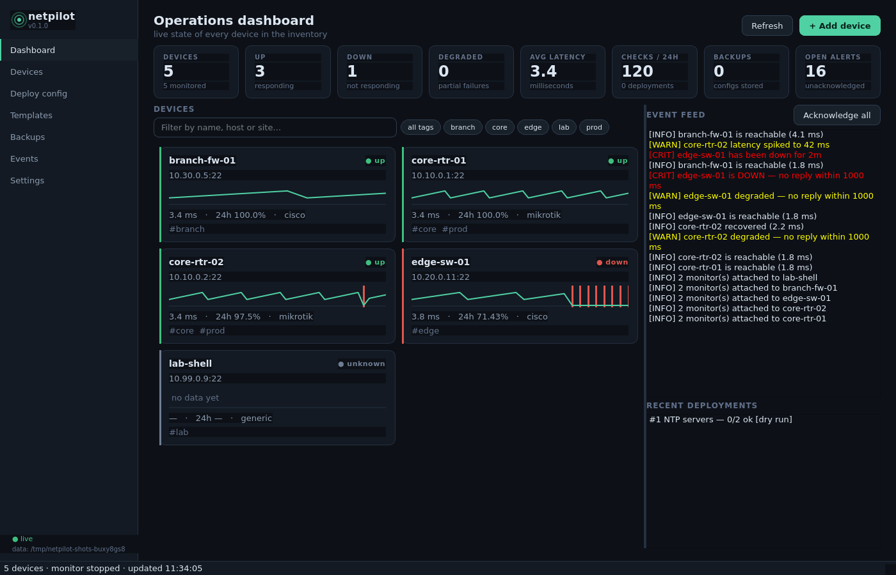
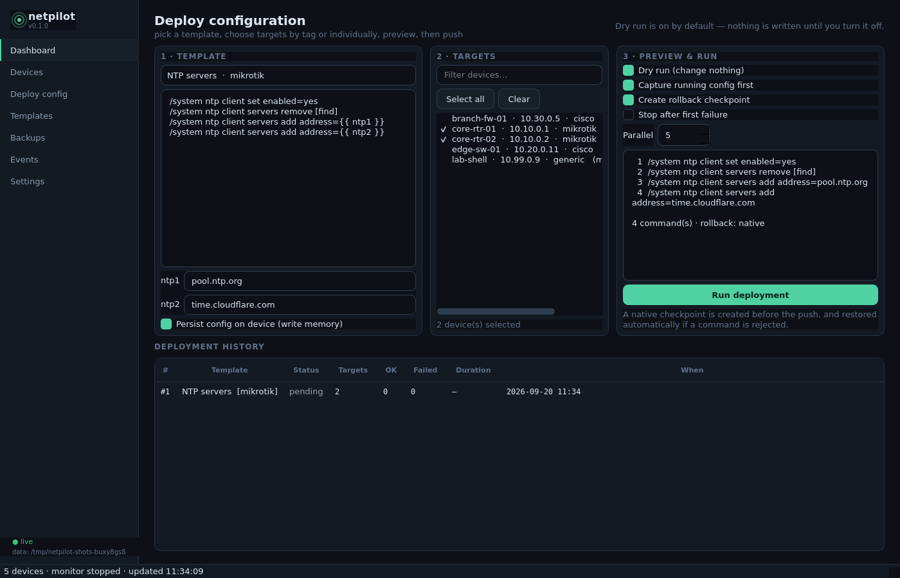
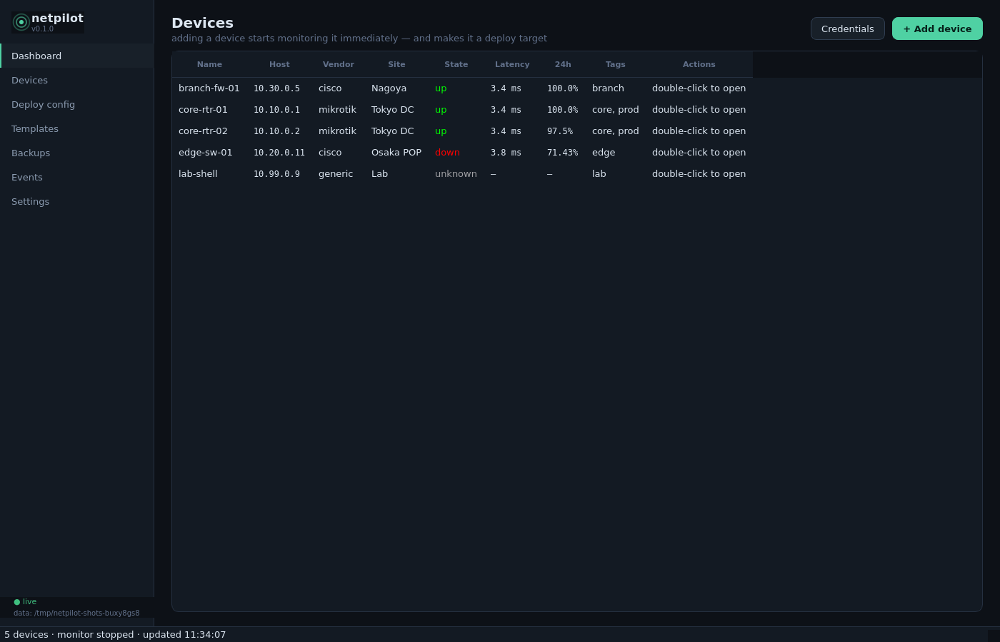

# netpilot

[](https://github.com/sasoun1366/netpilot/actions/workflows/test.yml)
[](https://www.python.org/)
[](LICENSE)
[](netpilot/desktop)
[](netpilot/web)

**One inventory. Monitor it, and push configuration to it — from the same place.**

netpilot is a network management platform for people who run real gear. Add a
MikroTik or Cisco device once and you get both halves of the job in one place:
continuous monitoring (ICMP/TCP/HTTP/SNMP/SSH), and a bulk configuration engine
that plans, previews, backs up, and rolls back a change across a whole group of
devices.

It ships as **three front ends over one core**: a CLI, a **web dashboard**, and a
**desktop app** — all reading and writing the same SQLite database, so a device
you add in one is monitored and deployable from the others.



## Why

Monitoring and configuration live in different tools almost everywhere. The
result is predictable: two inventories that drift apart, two sets of credentials,
and a change window where you push the same twenty lines by hand into a dozen
routers and hope you remembered all of them.

netpilot treats "watch this device" and "change this device" as the same row in
the same table.

- **Add a device → it is monitored immediately.** A wizard attaches a sensible
  starter set (ping + the management port), and the same dialog is where you push
  config to it. No second import, no second credential store.
- **Bulk changes are a first-class operation, not a for-loop.** Pick a template,
  tick targets by tag or individually, see the exact per-device commands, then
  run it — with a backup and a rollback checkpoint in front of every push.
- **Dry run is the default.** Nothing is written to a device until you uncheck it.

<table>
<tr>
<td width="50%"></td>
<td width="50%"></td>
</tr>
<tr>
<td><em>Bulk deploy: template → targets → preview → run.</em></td>
<td><em>The inventory both halves share.</em></td>
</tr>
</table>

## Features

### Monitoring

| Check | What it does |
|---|---|
| `icmp` | Ping with packet-loss and jitter stats; can fall back to TCP when the host has no raw-socket permission |
| `tcp` | Port reachability with connect latency |
| `http` | Status code, body match, TLS expiry, and response time |
| `snmp` | `sysUpTime`, interface counters, and any OID you name (`pysnmp`) |
| `ssh` | Login + optional command match — proves the device is *manageable*, not just pingable |

- **Health with hysteresis**: `failures_to_down` / `successes_to_up` so one lost
  packet is not an outage, and `degraded_latency_ms` so a link that is up but
  slow shows as degraded instead of green.
- **Availability history**: per check and per device (24h / 7d), with a sparkline
  on every card.
- **State transitions become events**, which become alerts (below).
- **Device state is worst-state-wins** across all of its checks.

### Configuration deployment

- **Template library** (16 built-ins, vendor-aware): NTP, SNMP v2c, login banner,
  SSH hardening, syslog collector, backup user, disable unused interfaces, DHCP
  for a VLAN, plus a raw-command escape hatch. Save your own; a saved template
  with a built-in's name overrides it.
- **Variables**: `{{ placeholders }}` with defaults and per-run overrides. A
  deploy that still has unresolved variables is **skipped, not sent** — a router
  never receives a literal `{{ ntp1 }}`.
- **Per-device rendering**: the exact command list is computed for every target
  at plan time and shown in the UI, so you review what will be typed, not what
  you hope will be typed.
- **Safety rails**: capture the running config first, create a vendor rollback
  checkpoint (`/system backup save` on RouterOS), auto-restore if a command is
  rejected, and an optional stop-on-first-failure abort that also stops the
  targets still waiting in the queue.
- **Wrong-tool protection**: a `generic` SSH host is monitoring-only and is
  refused by the deploy engine rather than having commands sprayed at it.

### Alerts

- Severity threshold, per-kind filters, and quiet hours.
- Delivery to **webhook** (JSON POST), **SMTP email**, **syslog** (RFC 5424), and
  **desktop notifications** — configurable per sink, with a delivery report so
  you can see whether your webhook actually answered.
- Alert delivery runs off the monitoring loop, so a slow SMTP server can never
  stall a probe.

### Three front ends, one core

| | Command | Notes |
|---|---|---|
| **Web** | `netpilot web` | FastAPI + a zero-dependency SPA (no CDN, no build step). Live event stream over SSE. |
| **Desktop** | `netpilot gui` | PyQt6, cross-platform, dark theme, all work off the GUI thread. |
| **CLI** | `netpilot …` | Machine-readable `--json` on every listing command. |

Everything is `netpilot/core.py::App` underneath: the same inventory, the same
monitor, the same deploy engine — which is also why adding a fourth front end
would be a small job.

## Install

```bash
pip install "netpilot[all]"     # CLI + web + desktop + SNMP
pip install "netpilot[web]"     # CLI + web dashboard
pip install netpilot            # CLI + core monitoring only
```

Or from source:

```bash
git clone https://github.com/sasoun1366/netpilot
cd netpilot
python -m venv .venv && . .venv/bin/activate
pip install -e ".[all]"
```

### Windows executables (no Python required)

Every [release](https://github.com/sasoun1366/netpilot/releases) ships prebuilt,
standalone Windows binaries, built automatically on `windows-latest` by GitHub
Actions:

- `netpilot-<version>-windows-desktop.exe` — the desktop app.
- `netpilot-<version>-windows-cli.exe` — the command-line tool.

To build them yourself (any OS):

```bash
pip install -e ".[packaging]"
pyinstaller packaging/netpilot-gui.spec
pyinstaller packaging/netpilot-cli.spec
# binaries land in dist/
```

## Quick start

Start with `netpilot doctor`. It checks the three things that surprise people on a
new host: ICMP capability, SNMP availability, and whether the data directory is
writable.

```bash
netpilot doctor
```

### Desktop

```bash
netpilot gui
```

1. **+ Add device** — host, vendor, and a credential. netpilot immediately
   attaches monitoring and starts probing.
2. Watch the **Dashboard**: states, latency sparklines, 24h availability, and the
   event feed.
3. **Deploy config** — choose a template, tick targets (auto-selected by vendor),
   review the rendered commands, then run. Dry run is on until you turn it off.

### Web dashboard

```bash
netpilot web --host 0.0.0.0 --port 8787
```

Then open `http://127.0.0.1:8787`. Same inventory, same everything — useful for a
jump host or a shared NOC screen. The page is served entirely from the package
(no CDN, no internet access needed).

### CLI

```bash
# Inventory — adding a device turns monitoring on in the same step
netpilot devices --add 10.10.0.1 --name core-rtr-01 --vendor mikrotik --tag core,prod
netpilot devices

# Monitoring
netpilot monitor                 # run the scheduler in the foreground
netpilot events --severity critical --unacked
netpilot backup --all            # capture running configs

# Deployment — preview first, always
netpilot templates                                        # browse the library
netpilot deploy --template "NTP servers" --tag core --dry-run --verbose
netpilot deploy --template "SSH hardening" --tag core --var mgmt_cidr=10.0.0.0/24
netpilot deploy --body "/system identity set name=r1" --device 1
```

`--json` works before or after the subcommand, and stdout stays pure JSON, so it
composes with `jq`:

```bash
netpilot devices --json | jq '.[] | select(.state.state != "up") | .name'
netpilot deploy --template "NTP servers" --all --dry-run --json | jq '.targets[].commands'
```

An empty target selection is refused for `deploy` (`--all` is the explicit way to
mean "every device") — but a bare `netpilot backup` does mean everything, because
a backup only reads.

## How it is put together

```
netpilot/
├── core.py            App — the single facade every front end talks to
├── models.py          dataclasses (Device, CheckConfig, CheckResult, Job, JobTarget…)
├── db.py              SQLite storage (WAL, migrations, one file for all front ends)
├── security.py        credential encryption at rest
├── monitoring/        checks.py (the probes), icmp.py, monitor.py (scheduler + state)
├── deploy/            engine.py (plan/run/rollback), templates.py (the library)
├── adapters/          base.py + mikrotik.py, cisco.py, generic.py, ssh.py, registry.py
├── alerts/            notifiers.py (webhook, SMTP, syslog, desktop)
├── web/               app.py (FastAPI + SSE) and static/ (the SPA)
├── desktop/           main_window.py, widgets.py, bridge.py (Qt ⇄ asyncio), app.py
└── cli.py             argparse front end
```

Two design choices worth knowing:

- **Rendering is pure text.** `Adapter.render_config` / `split_config` are
  classmethods, so a preview — in the CLI, the SPA, or the desktop app — never
  constructs an adapter and therefore never opens a socket. A dry run cannot
  contact a device even by accident.
- **State lives in SQLite, not in memory.** The monitor, the web app, and the
  desktop app can each be restarted independently and pick up exactly where the
  other left off.

### Adding a vendor

A vendor is one file implementing a small contract
(`netpilot/adapters/base.py`): a name, `supports_deploy`, `rollback_support`,
`fetch_config()`, and the commands to save/checkpoint. Then register it in
`adapters/registry.py`. Nothing in monitoring, deploy, or either UI needs to
change.

| Vendor | Adapter | Config push | Rollback |
|---|---|---|---|
| MikroTik RouterOS | `mikrotik` | yes | native (`/system backup`) |
| Cisco IOS / IOS-XE | `cisco` | yes | manual (config diff + `configure replace`) |
| Generic SSH shell | `generic` | monitoring only | — |

## Security model

- Credentials are encrypted at rest (Fernet, key derived via PBKDF2-HMAC-SHA256
  from a per-install secret). API responses redact them — `to_dict(redact=True)`
  is the only way credential payloads leave the process.
- Job listings never carry the config body or the pre-change backup; those are
  fetched per target on demand.
- SSH host keys are auto-accepted on first connect, like most lightweight
  automation tools. Strict pinning is on the roadmap.
- The web dashboard has **no authentication**: it is designed for
  `127.0.0.1`, a jump host, or behind your own reverse proxy/auth. Do not expose
  it directly to the internet.
- A deploy can change a device's config. That is the point — which is why dry run
  defaults to on, every push is preceded by a backup, and a rejected command
  triggers an automatic restore where the vendor supports one.

## Development

```bash
python -m venv .venv && . .venv/bin/activate
pip install -e ".[dev]"
pytest -q                    # 420 tests, no network access required
```

The suite runs against real sockets, a real SQLite file, and real HTTP servers
spun up inside the tests (a local TCP server, a `uvicorn` instance for the SSE
stream), so the behaviour under test is the shipped behaviour. Nothing in it
needs a physical router: the deploy tests drive the engine through a fake adapter
that records what it was asked to do.

```bash
QT_QPA_PLATFORM=offscreen python tools/screenshots.py   # regenerate docs/*.png
```

Contributions welcome. New adapters are the most useful kind — see
`netpilot/adapters/base.py`.

### If something goes wrong

The desktop app writes a log next to its database:

| Platform | Log |
| --- | --- |
| Windows | `%USERPROFILE%\.netpilot\netpilot.log` |
| macOS / Linux | `~/.netpilot/netpilot.log` |

If a window stops responding or an action seems to do nothing, that file has the
traceback. A failure early enough to beat the log setup goes to `netpilot-fatal.log`
beside it, and a hard crash dumps stacks to `netpilot-crash.log`. Any core call that has not returned within 20 seconds is logged there as
well, so a slow operation is distinguishable from a stuck one. The desktop suite in
`tests/test_desktop.py` drives the real window — adding a device, opening it,
deleting it — so the flows users live in are covered end to end.

## Roadmap

- [ ] Strict SSH host key verification / `known_hosts` support
- [ ] Native Juniper (`display set`) and Fortinet adapters
- [ ] Scheduled config backups from inside the UI (today: cron + `netpilot backup --all`)
- [ ] Authentication for the web dashboard
- [ ] Per-device maintenance windows (suppress alerts during a planned change)
- [ ] Config drift detection: alert when a device's running config diverges from its last backup

<!-- support:start -->
## Support the project

**netpilot** is built and maintained in my own time, and it stays free to use
and free to fork. If it saved you an outage — or just an afternoon — you can help
fund the next round of test hardware and the time to add more vendors:

**USDT (TRC20)**

```text
TMEyd1JZqdCjjKTc4zG2fhjzAYFKXCUWnA
```

This is the only address I publish for these projects. Anything else claiming to be
me is not mine.
<!-- support:end -->

## License

MIT — see [LICENSE](LICENSE).
